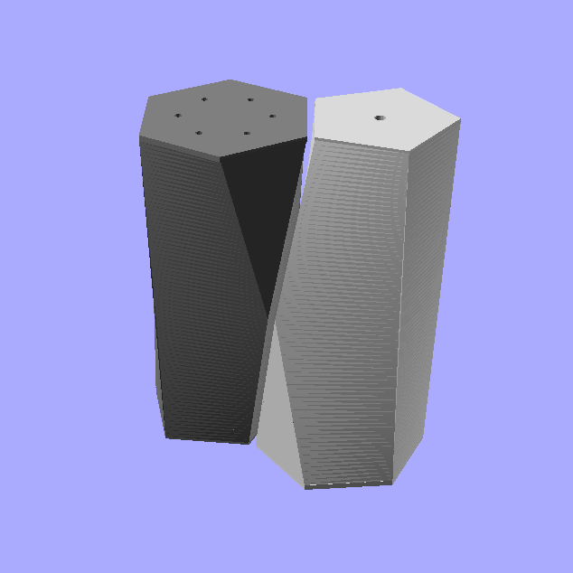

# scutoid_shakers.scad
Scutoid salt and pepper shakers in OpenSCAD

Scutoids are biologically inspired by cell packing in nature.

This scutoid model has top and bottom leveled regular pentagon and hexagon, transitioning from one to the other at mid height.  Corners and angles are mathematically derived to ensure perfect fit when a pair is packed side by side.  Flip one shaker over, its shape is identical to the other.  The other perfect fit is back to back (or two hexagons together, or two pentagons together).

Use your slicer to cut a dovetail joint at mid height for 3D printing.  Fill the bottom with your favorite condiment, and reattach the top with the hole(s).

